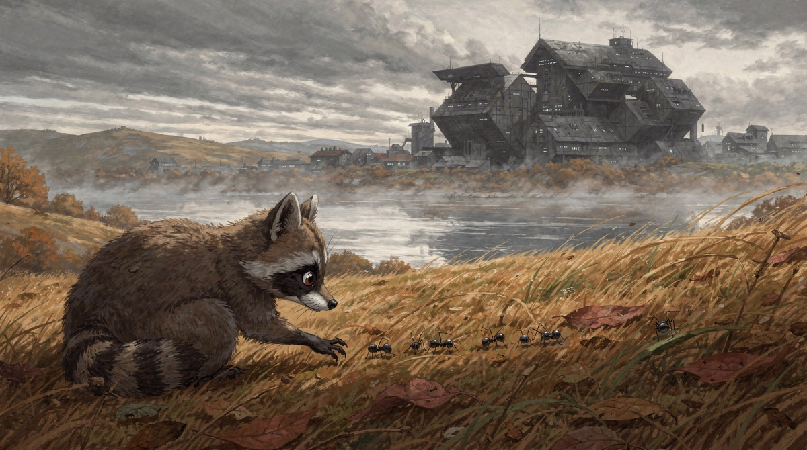
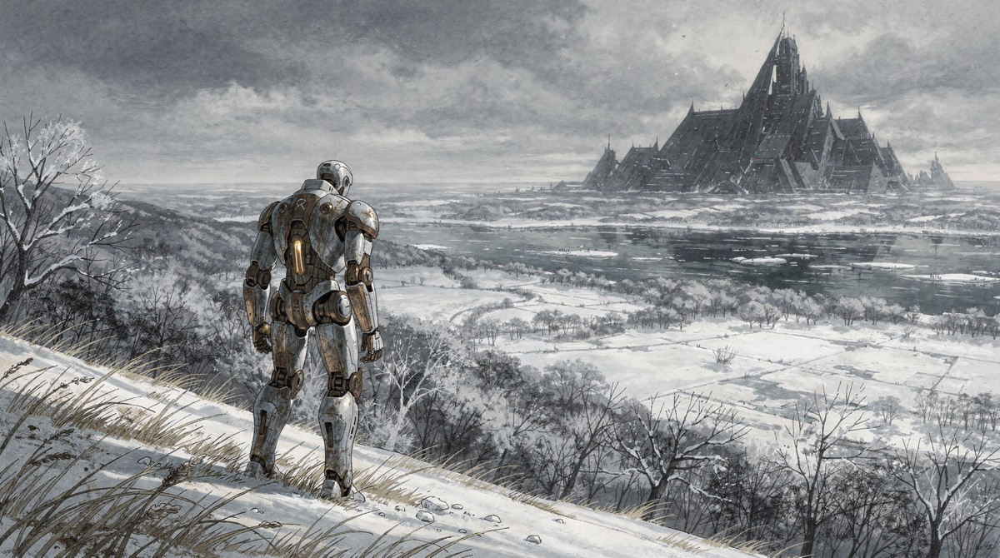
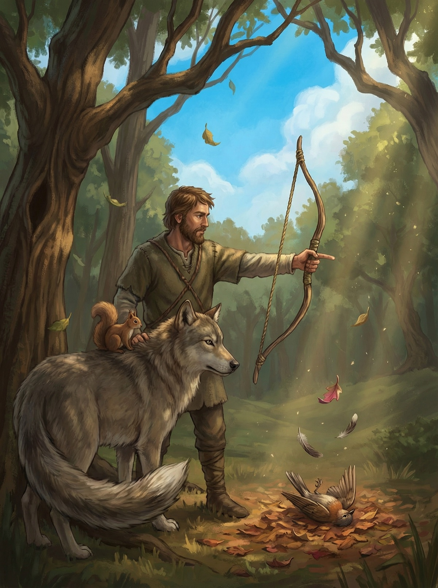

# image-gen

Five models, one pipeline, zero pip dependencies. This gallery is the proof -- same prompt pressure, different engines, real outputs.

Full runbook lives in [`SKILL.md`](./SKILL.md). This page is just the receipts.

## Flux 2 Pro -- example 1 (~$0.05/image)

Flux 2 Pro. Clean composition, good texture discipline, minimal prompt wrestling -- the kind of result that makes you stop second-guessing the pipeline.

## Flux 2 Pro -- example 2 (~$0.05/image)

Same model, second swing. This is where I check consistency -- not just one lucky frame, but repeatable quality when the brief gets slightly weird.

## NanoBanana Pro -- example 1 (~$0.04/image)

NanoBanana Pro. Cheaper, sometimes moodier -- but when it lands, it lands with character you cannot fake in post.

## Where this really started

This pipeline came out of one specific itch: I wanted proper illustrations for Clifford Simak's *City* (1952) -- talking dogs, dying cities, and a robot butler outliving humanity.
That constraint rewired the whole build.
You cannot throw "robot in snow" at a model and call it *City*, per se -- you need per-scene visual extraction and a style guide that tracks palette drift across 10,000 years of fictional history.
You also need consistency anchors for characters aging across eight tales, or the timeline collapses into noise.
The full method is in [`references/book-to-prompts-playbook.md`](references/book-to-prompts-playbook.md) -- it is a general playbook for turning any book into prompts, with *City* as the worked example.
So no, this was never for generic stock images -- a specific book demanded visual interpretation, and that specificity made the pipeline better at everything.

P.S. I keep these images around because memory lies; files do not.
